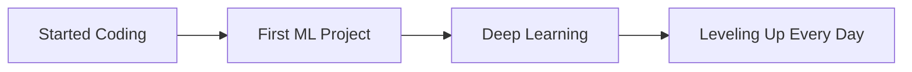

#  Hello World! I'm Het

  

## 💫 About Me

I'm a 17-year-old Machine Learning Engineer passionate about building intelligent systems and exploring the frontiers of AI. My journey in technology started early, and I've been diving deep into neural networks, computer vision, and natural language processing.

## 🚀 Skills

  
### Programming Languages

### ML/DL Frameworks

### Tools & Technologies

## 📊 GitHub Stats

  
  

## 🔥 Top Projects

  
  

## 🧠 Machine Learning Journey

## 📈 Contributions

  

## 📫 Connect with Me

  
  

---

  
  **"The only way to do great work is to love what you do."**
  

